#一、关闭的系统默认插件
       1、配置文件关闭：
        配置产品模块
        Mage_Rss，
        Mage_Authorizenet，
        Mage_GiftMessage，
        Mage_ConfigurableSwatches，
        Mage_Downloadable，
        Mage_Weee，
        Phoenix_Moneybookers
        2、后端关闭：
        Mage_AdminNotification
        Mage_Authorizenet
        Mage_Backup
        Mage_Bundle
        Mage_ConfigurableSwatches
        Mage_Downloadable
        Mage_PaypalUk
        Mage_Rss
        Mage_Weee
        Mage_XmlConnect
        Phoenix_Moneybookers
#二、使用的第三方插件
     1、Firecheckout 需要较大调整
     2、Mw(积分) 	 需要调整优化
     3、Aschroder--邮件发送插件smtp		
     4、AW--blog
     5、Inic--faq
     6、Hetinfoway--video	
     7、aoe---cron			
     8、DigitalPianism--ajax login (保留功能)	
     9、RocketWeb--google shipping		
     10、Zestard--客户属性后台自定义	
     11、订单异步测试		
     12、Vstudio---menu(自定义导航)
     13、Apptrian--minify
     14、Fishpig--wordpress
     15、Imsc--refersion
     16、Inchoo--SocialConnect
     17、Nexcessnet--Turpentine
#三、独立开始第三方插件
     1、wholesale
     2、staylooks
     3、luckydraw			
     4、paypal error	
     5、banner
     6、sms
#四、重构模块
###1、评论模块
     主要讲rating,移动到评论详情表，同时移除多余的字段
     移除表review_author_ips,review_helpful,review_proscons,rview_proscons_store
     Review_detail 移除字段：Cons,pros,body_type,sizing,location,age,height
###2、ajax异步完成
     所有翻页，属性筛选，加购，购物车(删除，更新)，支付页面
###3、支付页面
     支付页面的所有逻辑重新梳理重写（后端基于firecheckout方法）
     移除字段 tm_field1 ，tm_field2 ，tm_field3，tm_field4，tm_field5,fake_id ;
     移除表tm_orderattachment;
     
     tm  Additional  移除
     firecheckout_geoip 功能移除
     Address Verification (USPS) 功能移除
     对应地址栏逻辑进行梳理：
     
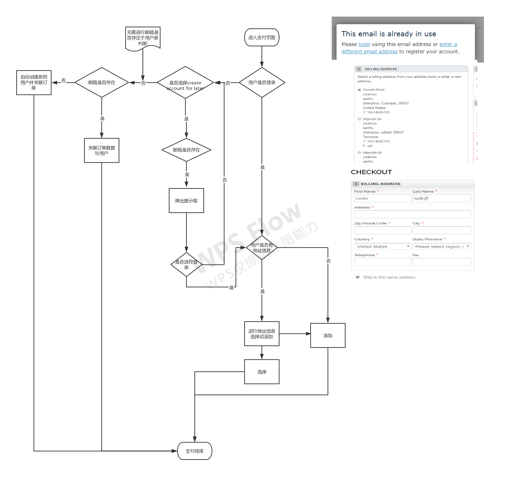
#五、启用产品，分类flat模型
#六、修改xml，支持底部移除css,js(功能暂未使用)
#七、通过nginx-lua支持将图片动态修改webp格式
#八、minify组件完成html压缩操作
#九、varnish完成新的缓存机制
#十、css,js同时支持min及常规两种形式
#十一、开发中遇到的问题及解决方案（author:王佳康）

###1、xml布局文件
     添加新的栏目布局，如果需要可以在后台进行设置，需在
     xml中进行配置。
     注：如果不需要在后台进行设置，则无需进行此配置，直接在
     xml中配置对应的布局模板即可。
    D:\web\julianew\app\code\local\Longqi\Public\etc\config.xml
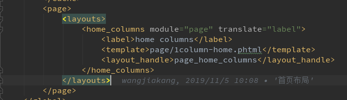 
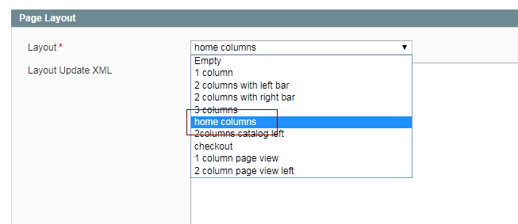 

---

###2、首页整体调用调整
     系统默认首页的内容是在后台cms->page中的单页填写的,因
     不利于后期维护，故将其重写至phtml页面中。
     D:\web\julianew\app\design\frontend\longqi\pc\layout\local.xml
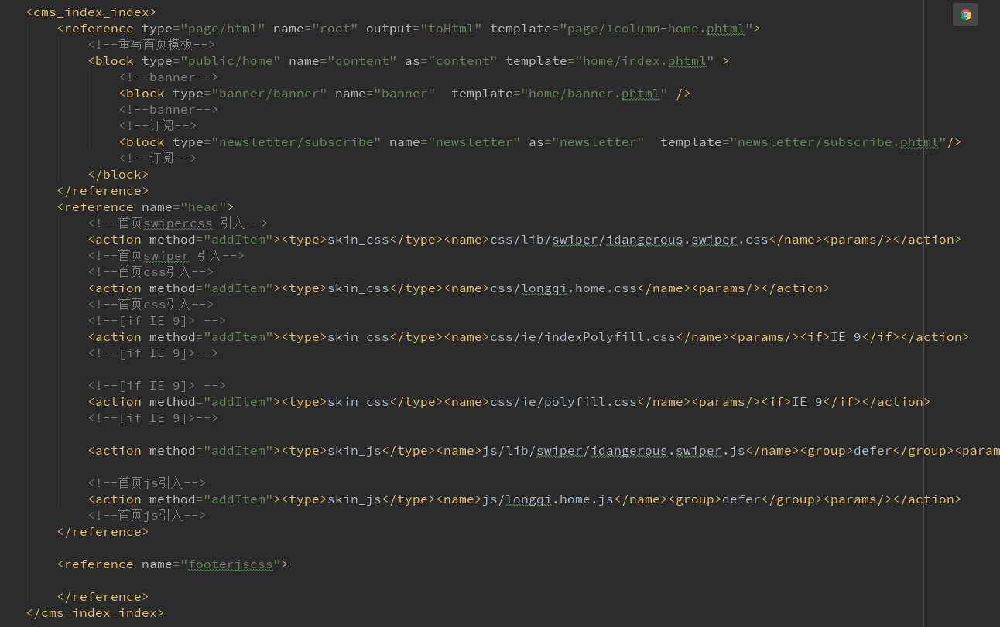

---
###3、调用指定栏目产品方法重构
     系统默认在block中调取分类是没有数量限制的，自定义方
     法进行数量限制
     D:\web\julianew\app\code\local\Mage\Catalog\Block\Product\List.php
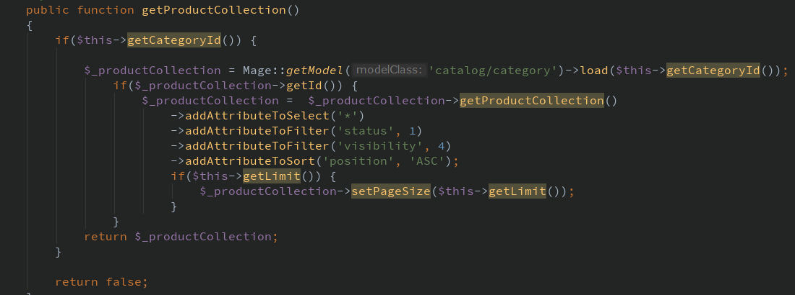

---     
   
###4、收藏产品红心标注
     登录情况下已收藏的产品红心的显示，因varnish缓存影响故
     不能用使用PHP对其判断，监听客户登录成功，将客户已收藏的
     产品ID存储到COOKIE中，然后在js中读取cookie进行红心展示。
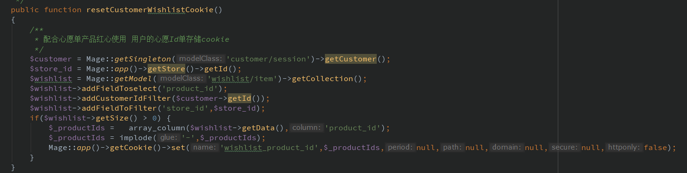
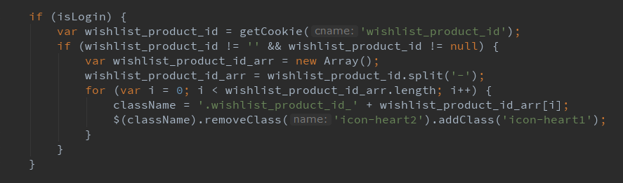

--- 

###5、配合varnish缓存机制配置
     因varnish缓存的缓存机制是全局缓存，然而一些不需要缓
     存的block或controller是需要在xml中指定不进行缓存的，如
     头部登录状态，头部购物车。
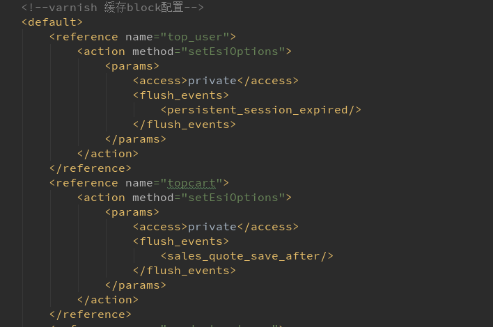     
注：指定不缓存block的xml需放在default中进行配置
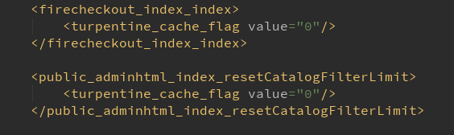   
---

###6、翻页通过ajax异步加载
     分页数据改为ajax请求，原系统默认的分页链接不变改为
     ajax方式对其链接进行请求，在后台获取block将phtml内容转
     换为json格式进行返回。
     注：因varnish缓存会根据链接进行缓存，所以ajax请求一定要添加参数与非ajax请求进行区分
     
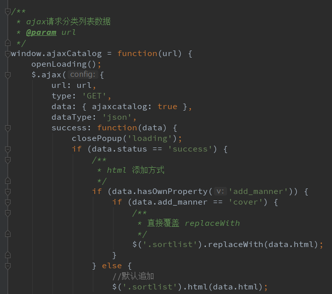   
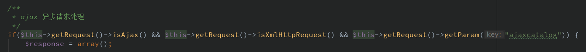   
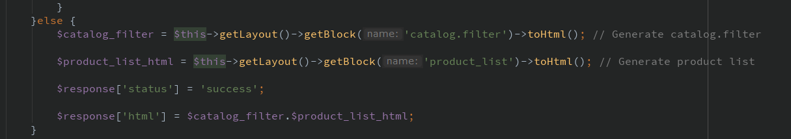   
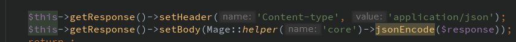   

---

###7、手机端属性筛选
     M端分类列表下拉属性筛选移至后台进行重置
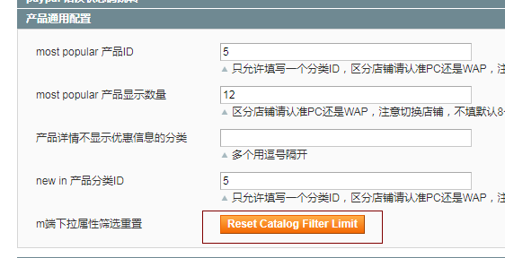   
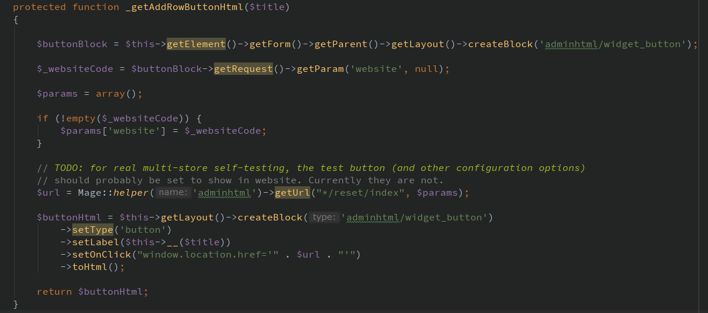
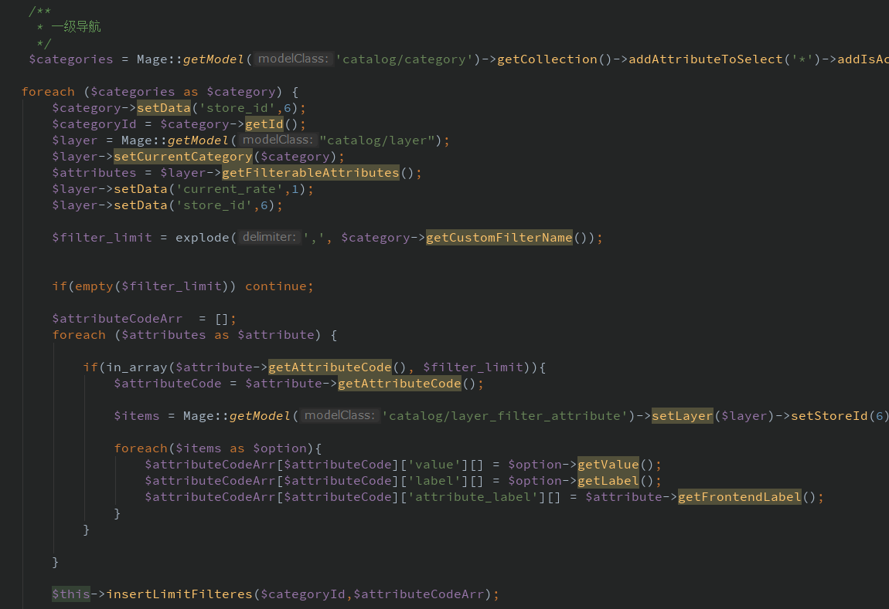

---