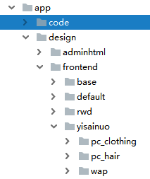
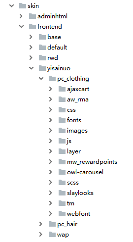

#前端规范手册
## 一、规范目的
         为提高团队协作效率, 便于后台人员添加功能及前端后期
         优化维护,
      输出高质量的文档, 特制订此文档. 本规范文档一经确认, 
      前端开发人员必须按本文档规范进行前台页面开发.
 (注释：<font color="red">细节规则还在进一步完善</font>）
## 二、前端主题结构
   #####desgin

---
***
   ######skin


        针对有大型的活动或者针对某个栏目进行板式的调整;进行
        新的视图创建；原则上不影响先有的站点布局及板式
 
##三、框架及命名规范
        文件夹及文件名称统一用小写的英文字母、数字和下划线的组
        合，其中不得包含汉字、空格和特殊字符（做到见名知意）；
        命名原则的指导思想：
        一是使得你自己和工作组的每一个成员能够方便的理解每一个
        文件的意义，
        二是当我们在文件夹中使用“按名称排例”的命令时，同一种
        大类的文件能够排列在一起，以便我们查找、修改、替换等
        操作。

<font color='red'>所有页面在body 上都有一个class，名称与控制器名称保持一致（eg:cms-index-index,catalog-category-view,catalog-product-view）</font>
##四、网页细节要求：
        1、Alt和Title 对应 img ，href 标签 必须添加这两个属性 
        2、href 空链接：<a href="javascript:;" class="js-asdf">javascript</a>
        3、h 标签页面应用：（待定）
        4、所有与产品相关的 单个产品的最外层需要添加 data-id,
        data-category 属性（配合第三方代码部署）
        5、所有图片必须使用延迟加载

##五、css,js引入规则
        1、	基础：该类别中包含的是默认的 CSS 
        样式。作为其他样式的基础——base.css。
        2、不同页面分别引入：
        自定义.css 文件 格式为 longqi.使用页面名称（功能名称）.css 
        (
        首页: longqi.home.css;
        产品列表页:longqi.catalog.category.css;
        详情页面:longi.catalog.product.css;
        支付页面:longqi.checkout.css;
        用户页面:longqi.customer.css;
        其他活动页面:longqi.对应活动名称.css
        );
        3、主题：该类别和状态类似，只不过是用来改变布局和模
        块的视觉效果theme.css。（大型活动）
        4、css 正式站引入均是压缩过的（.min.）
        5、基于less 完成
##六、css命名规范（BEM命名法：模块名 + 元素名 + 修饰器名）
        a. - 中划线 ：仅作为连字符使用，表示某个块或者某个子元
        素的多单词之间的连接记号。
        b. __ 双下划线（改成_）：双下划线用来连接块和块的子元素
        c. --双中划线：单下划线用来描述一个块或者块的子元素
        的一种状态
        d. 其中名称用统一用小写英文单词（可以缩写，但需要
        在注释中说明全称）
        比如分页组件，那么该组件模块就名为page-btn，组件内部
        的元素命名都必须加上模块名：
```
<div class="page-btn">
        <button type="button" class="page-btn_prev page-btn--active">上一页</button>
        <button type="button" class="page-btn_next">下一页</button>
</div>
```
##七、css书写规范（提高可读性，减少维护成本）
    待完善....
##八、注释规范
        /* Header */
        内容区
        /* End Header */
        
        /**
        *  对模块进行说明。
        *  如果模块类名缩写了也说明一下。
        *  Firecheckout 缩写成fc
        *
        */
##九、js规则
        以上css规则同样适用js规则
##十、image图片
        所有图片转化为webp格式----这的转化通过nginx嵌入lua完成
##十一、phml视图文件
    1、所有视图文件中不要出现命名js方法的现象出现
    2、做好注释
        /**
         *  评论数量和星级
         *
         * @see Mage_Catalog_Block_Product_List
         */
          任何添加的代码都要做好注释
     3、不要在视图代码中出现大面积后端逻辑代码，理论上视图中
     的后端代码仅负责传送数据